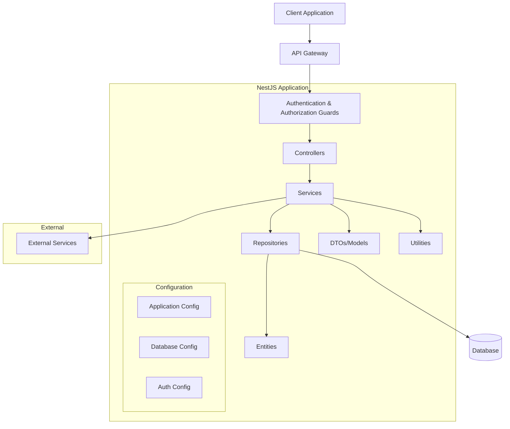

# Backend Architecture

This document describes the architecture of the KINE-SAAS backend application built with NestJS.

## System Architecture Overview

The KINE-SAAS backend is built using NestJS, a progressive Node.js framework for building efficient, scalable server-side applications. The application follows a modular architecture with clear separation of concerns.



## NestJS Layered Architecture

The application follows the standard NestJS layered architecture:

### Controllers Layer
Controllers handle HTTP requests and delegate processing to services. They:
- Define routes and endpoints
- Validate incoming requests
- Apply guards and interceptors
- Return appropriate HTTP responses

### Services Layer
Services contain the business logic of the application:
- Process data and implement business rules
- Coordinate between multiple repositories
- Handle errors and exceptions
- Transform data between DTOs and entities

### Repository Layer
Repositories handle data persistence:
- Interact with the database through TypeORM
- Execute CRUD operations
- Handle database transactions
- Implement complex queries

### Entities Layer
Entities represent the domain models:
- Define database schema
- Implement entity relationships
- Define validation rules

## Module Organization

The application is organized into feature modules, where each module encapsulates related functionality:

```
src/
├── app.module.ts          # Root module
├── main.ts                # Application entry point
├── modules/              
│   ├── patient/           # Patient module
│   ├── appointments/      # Appointments module
│   └── ...                # Other feature modules
├── users/                 # User management
├── auth/                  # Authentication
├── config/                # Configuration
└── database/              # Database and seeding
```

Each feature module contains:
- Controllers
- Services
- DTOs
- Entities
- Repository interfaces

## TypeORM Implementation

TypeORM is used as the Object-Relational Mapping (ORM) tool:

### Configuration
Database configuration is centralized in `/config/database.config.ts`, which:
- Loads database connection parameters from environment variables
- Configures entity auto-loading from module directories
- Sets up migrations path
- Configures logging and SSL options

### Entities
Entities are defined with TypeORM decorators:
- `@Entity()` - Marks a class as a database table
- `@Column()` - Defines table columns with data types
- `@PrimaryGeneratedColumn()` - Defines primary keys
- `@OneToMany()`, `@ManyToOne()`, etc. - Define relations

### Example Entity
```typescript
@Entity('patients')
export class Patient {
  @PrimaryGeneratedColumn('uuid')
  id: string;

  @Column()
  firstName: string;
  
  @ManyToOne(() => Kinesitherapeute, kine => kine.patients)
  @JoinColumn({ name: 'kinesitherapeute_id' })
  kinesitherapeute: Kinesitherapeute;
}
```

### Data Source
A central `AppDataSource` is defined in `src/database/data-source.ts` for:
- CLI operations
- Migrations
- Seeding

## Authentication and Guards

The authentication system uses JWT (JSON Web Tokens):

### Authentication Flow
1. User logs in with credentials
2. Server validates credentials
3. Server issues JWT token
4. Client includes token in subsequent requests
5. Guards validate token for protected routes

### Guards
Several types of guards protect routes:
- `JwtAuthGuard`: Verifies JWT token authenticity
- `RolesGuard`: Ensures user has required role permissions
- `OwnershipGuard`: Verifies resource ownership for operations

### Role-Based Access Control
Role-based access control is implemented using:
- Role enum in User entity
- `@Roles()` decorator on controllers/routes
- `RolesGuard` to enforce role requirements

## Seeding System

A modular database seeding system is implemented:

### Structure
```
database/
├── seed.ts               # Main seed runner
├── seeds/               
│   └── main.seed.ts      # Seeder orchestration
└── seeders/             
    ├── base.seeder.ts    # Abstract base seeder
    ├── user.seeder.ts    # User seeder
    └── ...               # Other entity seeders
```

### Base Seeder
The base seeder defines the common interface:
```typescript
export abstract class BaseSeeder {
  protected static readonly entityClass: EntityTarget<any>;
  constructor(protected readonly entityManager: EntityManager) {}
  abstract execute(): Promise<void>;
  abstract getName(): string;
  abstract clean(): Promise<void>;
}
```

### Seed Orchestration
The seeding process:
1. Creates an entity manager from the data source
2. Cleans existing data in reverse dependency order
3. Seeds data in dependency order

## Exception Handling

The application implements centralized exception handling:
- HTTP exceptions (`HttpException`) for standard HTTP errors
- Custom exceptions for business logic errors
- Exception filters to format error responses consistently

## Environment Configuration

Environment configuration is managed through:
- `.env` files for local development
- Environment variables for production
- `@nestjs/config` for accessing configuration values
- Configuration factory functions for type safety

## API Documentation

API documentation is generated using Swagger:
- OpenAPI decorators on controllers and DTOs
- Swagger UI for interactive documentation
- Authentication integration for testing secured endpoints

This architecture provides a solid foundation for a maintainable, scalable, and secure backend application.
