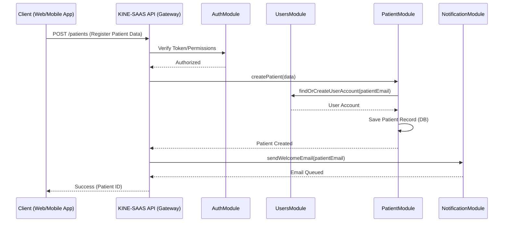

# KINE-SAAS: High-Level Architecture

**Version:** 1.0
**Date:** May 16, 2025
**Author:** GitHub Copilot (Senior Software Solution Architect)

## 1. Overview and Vision

**KINE-SAAS** is a comprehensive Software-as-a-Service (SaaS) platform designed to streamline and modernize the operations of physiotherapy clinics in Morocco. The platform aims to improve clinic efficiency, enhance patient care, and ensure regulatory compliance by providing a suite of integrated tools for patient management, medical records, scheduling, billing, and more.

**Business Value:**
*   **Operational Efficiency:** Automates routine tasks, reduces paperwork, and optimizes resource allocation.
*   **Enhanced Patient Care:** Provides quick access to patient history, treatment plans, and progress tracking, enabling personalized and effective care.
*   **Data Security and Compliance:** Ensures secure management of sensitive patient data (PHI) in line with relevant regulations.
*   **Scalability:** Offers a solution that can grow with the clinic, from small practices to larger multi-branch establishments.
*   **Accessibility:** Provides a centralized platform accessible to authorized personnel, improving collaboration and information sharing.

## 2. Technology Stack Justification

The chosen technology stack is pivotal for building a robust, scalable, and maintainable SaaS platform.

*   **NestJS (Node.js Framework):**
    *   **Why:** Provides a highly structured, modular, and scalable architecture out-of-the-box, heavily inspired by Angular. Its use of TypeScript enhances code quality and maintainability. The extensive ecosystem and strong community support make it ideal for building enterprise-grade applications. Excellent for API development with features like built-in support for microservices, WebSockets, and GraphQL.
*   **PostgreSQL (Relational Database):**
    *   **Why:** A powerful, open-source object-relational database system with a strong reputation for reliability, feature robustness, and performance. It supports complex queries, ACID transactions, and has excellent extensibility. Ideal for storing structured patient and operational data.
*   **TypeORM (Object-Relational Mapper):**
    *   **Why:** A mature ORM for TypeScript and JavaScript that supports PostgreSQL. It simplifies database interactions, promotes code-first or schema-first development, and helps manage database migrations. Its strong typing aligns well with NestJS and TypeScript, reducing runtime errors.
*   **JWT (JSON Web Tokens) for Authentication:**
    *   **Why:** A standard, secure, and stateless method for representing claims between two parties. Ideal for API authentication, as tokens can be easily passed in HTTP headers and verified by the server without needing to query a database session store on each request, which aids scalability.

**Modular Monolith vs. Microservices:**

*   **Recommendation:** Start with a **Modular Monolith**.
*   **Why:**
    *   **Simplicity in Early Stages:** For a new SaaS product, a modular monolith reduces initial operational complexity. Managing a single codebase, deployment, and infrastructure is significantly easier than a distributed microservices architecture.
    *   **Faster Development Velocity:** Initial development and iteration cycles are typically faster with a monolith as there's less inter-service communication overhead and complexity to manage.
    *   **Strong Cohesion, Loose Coupling (within the monolith):** NestJS's module system allows for clear separation of concerns, effectively creating "mini-applications" within the monolith. This means modules like `PatientManagement`, `MedicalRecords`, etc., can be developed and reasoned about independently to a large extent.
    *   **Easier Refactoring:** Refactoring across module boundaries is simpler within a single codebase compared to coordinating changes across multiple microservices.
    *   **Cost-Effective:** Initially, a monolithic deployment is generally less expensive in terms of infrastructure and monitoring.
    *   **Path to Microservices:** A well-designed modular monolith can be strategically broken down into microservices later as the application scales, business needs evolve, or specific modules require independent scaling or technology stacks. The clear boundaries defined by NestJS modules make this transition smoother.

Microservices introduce significant complexities (distributed transactions, service discovery, inter-service communication, complex testing, higher operational overhead) that are often not justified in the early stages of a product unless specific, well-understood scalability or team structure demands them from day one. For KINE-SAAS, the benefits of a modular monolith outweigh the premature adoption of microservices.

## 3. Logical Architecture

The KINE-SAAS platform will be structured as a modular monolith, with clearly defined modules responsible for specific domains.

**Core Modules:**

1.  **`AuthModule` (Authentication & Authorization):**
    *   **Responsibilities:** User registration, login (JWT generation), password management, role-based access control (RBAC) enforcement, token validation.
2.  **`UsersModule` (User Management):**
    *   **Responsibilities:** CRUD operations for user accounts (clinic staff, admins), profile management, linking users to roles.
3.  **`RolesModule` (Role Management):**
    *   **Responsibilities:** Defining and managing user roles (e.g., Admin, Kinesitherapeute, Receptionist) and their associated permissions.
4.  **`PatientModule` (Patient Management):**
    *   **Responsibilities:** Patient registration, demographic information, emergency contacts, insurance details, consent form management. CRUD operations for patient records.
5.  **`MedicalRecordModule` (Medical Records):**
    *   **Responsibilities:** Managing patient medical history, consultation notes, treatment plans, progress tracking, diagnoses, and prescribed exercises. Secure storage and access control for sensitive PHI.
6.  **`AppointmentModule` (Scheduling & Appointments):**
    *   **Responsibilities:** Booking, rescheduling, and canceling appointments. Calendar views for kinesitherapeutes and patients. Appointment reminders.
7.  **`BillingModule` (Billing & Invoicing):**
    *   **Responsibilities:** Generating invoices, tracking payments, managing insurance claims (if applicable), financial reporting.
8.  **`DocumentModule` (Document Management):**
    *   **Responsibilities:** Secure upload, storage, and retrieval of documents (e.g., consent forms, medical reports, insurance cards). Versioning and access control.
9.  **`NotificationModule` (Notifications):**
    *   **Responsibilities:** Sending notifications (email, SMS, in-app) for appointments, reminders, system alerts.
10. **`AnalyticsModule` (Reporting & Analytics):**
    *   **Responsibilities:** Generating reports on clinic performance, patient statistics, financial data. Provides insights for decision-making. (Potentially a separate service in the future).
11. **`KinesitherapeuteModule` (Physiotherapist Management):**
    *   **Responsibilities:** Managing profiles of physiotherapists, their specializations, availability, and association with patients.

**Cross-Cutting Concerns (Handled by NestJS features/custom providers):**
*   **Configuration Management:** (`ConfigModule`)
*   **Logging:** (Built-in NestJS logger or custom integration)
*   **Error Handling:** (Global exception filters)
*   **Data Validation:** (Pipes and class-validator)
*   **Database Interaction:** (TypeORM, Repositories)

**Mermaid Diagram: Logical Module Breakdown**

```mermaid
graph TD
    A[Client Applications (Web/Mobile)] --> B{KINE-SAAS API Gateway (NestJS)};

    subgraph KINE-SAAS Modular Monolith
        B --> C[AuthModule];
        B --> D[UsersModule];
        B --> E[RolesModule];
        B --> F[PatientModule];
        B --> G[MedicalRecordModule];
        B --> H[AppointmentModule];
        B --> I[BillingModule];
        B --> J[DocumentModule];
        B --> K[NotificationModule];
        B --> L[AnalyticsModule];
        B --> M[KinesitherapeuteModule];

        C --> D;
        D --> E;
        F --> G;
        F --> H;
        F --> I;
        F --> J;
        M --> H;
        M --> F;
        
        subgraph Core Services
            S1[Database (PostgreSQL)];
            S2[File Storage (e.g., S3, Local)];
            S3[Email Service (e.g., SendGrid, SMTP)];
        end

        C ----> S1;
        D ----> S1;
        E ----> S1;
        F ----> S1;
        G ----> S1;
        H ----> S1;
        I ----> S1;
        J ----> S1;
        J ----> S2;
        K ----> S3;
        L ----> S1;
        M ----> S1;
    end

    style B fill:#f9f,stroke:#333,stroke-width:2px;
```

## 4. Physical Architecture

**Deployment Strategy:**

*   **Initial Deployment:** The NestJS application (modular monolith) will be containerized using **Docker**.
*   **Orchestration:** For scalability, resilience, and automated management, **Kubernetes (K8s)** is recommended as the target deployment environment. Alternatively, managed container services like AWS ECS, Google Cloud Run, or Azure Container Apps can be used.
    *   A simpler initial deployment could involve Docker Compose on a single or few VMs if K8s expertise is limited, with a plan to migrate to K8s as the platform grows.
*   **Database:** PostgreSQL can be deployed as a managed service (e.g., AWS RDS, Google Cloud SQL, Azure Database for PostgreSQL) for ease of maintenance, backups, and scaling, or self-hosted within the K8s cluster (requiring more operational overhead).
*   **Web Server/Proxy:** An ingress controller in K8s (e.g., Nginx Ingress) or a dedicated load balancer will manage incoming traffic, SSL termination, and routing to the application pods.

**External Dependencies:**

*   **Email Service:** A third-party email service (e.g., SendGrid, AWS SES, Mailgun) for transactional emails (registration, password resets, notifications). This offloads email delivery complexity.
*   **File Storage:** For documents and other large files, an object storage service (e.g., AWS S3, Google Cloud Storage, Azure Blob Storage) is recommended for scalability, durability, and cost-effectiveness.
*   **Payment Gateway (Future):** If direct payment processing is integrated, a secure payment gateway provider will be an external dependency.
*   **SMS Gateway (Optional):** For SMS notifications, a third-party SMS provider.

**Suggested CI/CD Pipeline Structure:**

A robust CI/CD pipeline is crucial for rapid iteration and reliable deployments.

1.  **Source Control:** Git (e.g., GitHub, GitLab, Bitbucket).
2.  **CI Server:** (e.g., GitHub Actions, GitLab CI, Jenkins).
    *   **Trigger:** On push/merge to main/develop branches or on pull request creation.
    *   **Steps:**
        1.  **Checkout Code:** Fetch the latest code.
        2.  **Install Dependencies:** `npm install` or `yarn install`.
        3.  **Linting & Static Analysis:** Run ESLint, Prettier.
        4.  **Unit Tests:** `npm run test`.
        5.  **Integration Tests:** `npm run test:e2e`. (May require a test database).
        6.  **Security Scans:** (e.g., Snyk, npm audit).
        7.  **Build Application:** `npm run build`.
        8.  **Build Docker Image:** Create a production-ready Docker image.
        9.  **Push Docker Image:** Push to a container registry (e.g., Docker Hub, AWS ECR, Google GCR).
3.  **CD Server/Mechanism:** (e.g., ArgoCD for K8s, Spinnaker, GitHub Actions, GitLab CI).
    *   **Trigger:** Successful CI build on a specific branch (e.g., `main` for production, `staging` for a staging environment).
    *   **Environments:**
        *   **Development:** Developers run locally or against a shared dev environment.
        *   **Staging:** A production-like environment for final testing and UAT. Deployed automatically after CI on `develop` or `staging` branch.
        *   **Production:** Deployed after successful staging validation (can be manual approval gate or automated from `main` branch).
    *   **Deployment Strategy:**
        *   **Kubernetes:** Update K8s deployment manifests (e.g., using Helm or Kustomize) to roll out the new image version. Employ strategies like Blue/Green or Canary deployments for zero-downtime updates.
        *   **Database Migrations:** Handle database schema migrations carefully as part of the deployment process (e.g., TypeORM migrations run before the new application version is fully live).

## 5. Security Architecture

Security is paramount, especially when handling Personal Health Information (PHI).

*   **Authentication (JWT):**
    *   Users authenticate with credentials (e.g., email/password).
    *   Upon successful authentication, the `AuthModule` generates a signed JWT containing user ID, roles, and an expiration time.
    *   The JWT is sent back to the client and included in the `Authorization` header (Bearer token) for subsequent API requests.
    *   The server validates the JWT signature and expiration on each protected request.
    *   Use strong, secret keys for signing JWTs, managed securely (e.g., environment variables, secrets manager).
    *   Implement refresh tokens for longer-lived sessions without exposing long-lived access tokens.
*   **Authorization (RBAC):**
    *   **Roles:** Define roles (Admin, Kinesitherapeute, Receptionist, Patient - if they have portal access).
    *   **Permissions:** Associate specific permissions with each role (e.g., a Kinesitherapeute can access medical records of their assigned patients, but not billing information unless permitted).
    *   **Route Protection:** Use NestJS Guards (`AuthGuard`, custom `RolesGuard`) to protect routes based on JWT validity and user roles.
    *   Permissions can be fine-grained, potentially using a claims-based approach within the JWT or by looking up permissions from the database based on the user's role.
*   **Sensitive Data Protection (PHI):**
    *   **Encryption at Rest:**
        *   Database-level encryption for sensitive fields in PostgreSQL (e.g., using `pgcrypto` extension or transparent data encryption if offered by the managed service).
        *   Encrypt backups.
    *   **Encryption in Transit:**
        *   Enforce HTTPS for all API communication using TLS/SSL certificates.
    *   **Access Controls:** Strict RBAC to ensure only authorized personnel can access PHI.
    *   **Audit Trails:** Log access to and modifications of PHI for accountability and compliance.
    *   **Data Minimization:** Collect and store only the PHI necessary for the intended purpose.
    *   **Anonymization/Pseudonymization:** For analytics or research, use anonymized or pseudonymized data where possible.
    *   **Compliance:** Adhere to Moroccan data protection laws (e.g., Law No. 09-08) and consider international standards like HIPAA or GDPR as best practices if future expansion is planned.
*   **Other Security Measures:**
    *   **Input Validation:** Use NestJS pipes and `class-validator` to validate all incoming data to prevent injection attacks (SQLi, XSS).
    *   **Rate Limiting:** Implement rate limiting (e.g., `nestjs-throttler`) to protect against brute-force attacks and DoS.
    *   **Helmet:** Use Helmet or similar middleware to set various HTTP headers for security.
    *   **Dependency Scanning:** Regularly scan dependencies for known vulnerabilities.
    *   **Regular Security Audits & Penetration Testing.**

## 6. Scalability Considerations

The modular monolith architecture with NestJS and PostgreSQL provides a good foundation for scalability.

*   **Vertical Scaling:**
    *   Increase resources (CPU, RAM) for the application server(s) and database server. Simpler but has limits.
*   **Horizontal Scaling (Application Tier):**
    *   Run multiple instances of the NestJS application (Docker containers/K8s pods) behind a load balancer. Since JWT authentication is stateless, this is straightforward.
    *   This is the primary way the application tier will scale.
*   **Database Scaling:**
    *   **Read Replicas:** Use PostgreSQL read replicas to offload read-heavy queries, improving performance for read operations.
    *   **Connection Pooling:** Essential for managing database connections efficiently.
    *   **Sharding (Future):** For very large datasets, database sharding might be considered, but this adds significant complexity and should be a last resort.
*   **Independent Scaling of Components (within the monolith):**
    *   While the entire application is deployed as one unit, resource-intensive tasks or modules (e.g., `AnalyticsModule` for complex report generation, `DocumentModule` for file processing) can be designed to use background workers or queues (e.g., BullMQ with Redis). These worker processes can be scaled independently of the main API request-response cycle.
*   **When to Split into Microservices:**
    *   **Team Structure:** If the development team grows significantly and can be organized around specific domains, microservices can enable independent team velocity.
    *   **Independent Scalability Needs:** If a specific module (e.g., `NotificationModule` or `BillingModule`) has vastly different scaling requirements or resource profiles than the rest of the application.
    *   **Technology Diversity:** If a particular part of the system would greatly benefit from a different technology stack (e.g., a Python service for ML-based analytics).
    *   **Fault Isolation:** If the failure of one non-critical module should not impact the core functionality of other modules (though this can also be achieved to some extent with robust error handling in a monolith).
    *   **Extremely High Load on Specific Features:** If a feature becomes so popular it strains the entire monolith.

    The transition should be strategic, starting with the most problematic or clearly delineated modules. The existing NestJS module boundaries will serve as good candidates for microservice extraction.

## 7. Project Structure Best Practices (NestJS)

NestJS promotes a structured approach. The current structure (`apis/src/modules/...`) is a good start.

*   **Top-Level `src/` Directory:**
    *   `main.ts`: Application entry point.
    *   `app.module.ts`: Root module.
    *   `app.controller.ts`, `app.service.ts`: (Optional, for very global routes/logic).
    *   `config/`: For application configuration (database, JWT, etc.).
    *   `common/`: For shared utilities, decorators, guards, interceptors, pipes that are not specific to a single module.
    *   `database/`: For TypeORM configuration, base entities, migrations, seeders.
    *   `modules/` (or feature-based directories directly under `src/`):
        *   Each business domain/feature gets its own directory (e.g., `users/`, `patients/`, `medical-records/`).
        *   **Inside each module directory (e.g., `patients/`):**
            *   `patients.module.ts`: Defines the NestJS module.
            *   `patients.controller.ts`: Handles incoming HTTP requests, delegates to service.
            *   `patients.service.ts`: Contains business logic, interacts with repositories/other services.
            *   `entities/`: Contains TypeORM entity definitions (e.g., `patient.entity.ts`).
            *   `dto/`: Data Transfer Objects for request/response validation and shaping (e.g., `create-patient.dto.ts`, `update-patient.dto.ts`).
            *   `repositories/` (Optional): Custom TypeORM repositories if complex queries are needed beyond basic service logic.
            *   `guards/`, `interceptors/`, `pipes/` (Module-specific): If these are only used within this module.
            *   `tests/`: Unit and integration tests for the module (e.g., `patients.service.spec.ts`, `patients.controller.spec.ts`).

*   **Separation of Concerns:**
    *   **Controllers:** Thin, responsible for request/response handling, validation, and calling services. No business logic.
    *   **Services:** Contain core business logic, orchestrate operations, interact with repositories or other services.
    *   **Entities:** Represent database table structures and relationships.
    *   **DTOs:** Define the shape of data for API contracts. Use `class-validator` and `class-transformer` for robust validation and transformation.
    *   **Repositories:** Abstract database interaction logic. TypeORM repositories provide much of this, but custom repositories can encapsulate complex queries.

*   **Modularity:**
    *   Ensure modules are as self-contained as possible, with well-defined public interfaces (exported services/providers).
    *   Use NestJS dependency injection extensively.

## 8. DevOps and Monitoring Suggestions

*   **Logging:**
    *   **Structured Logging:** Implement structured logging (e.g., JSON format) throughout the application. NestJS's built-in logger can be extended, or use libraries like Winston or Pino.
    *   **Log Levels:** Use appropriate log levels (DEBUG, INFO, WARN, ERROR).
    *   **Centralized Logging:** Ship logs to a centralized logging platform (e.g., ELK Stack - Elasticsearch, Logstash, Kibana; Grafana Loki; Datadog; Splunk). This allows for easy searching, analysis, and alerting.
*   **Monitoring:**
    *   **Application Performance Monitoring (APM):** Tools like Datadog, New Relic, Dynatrace, or open-source alternatives like Prometheus with Grafana. APM provides insights into request latency, error rates, transaction traces, and performance bottlenecks.
    *   **Infrastructure Monitoring:** Monitor CPU, memory, disk, and network usage of servers/containers (Prometheus, Grafana, CloudWatch, Google Cloud Monitoring).
    *   **Database Monitoring:** Monitor database performance, query latency, connections, replication lag (e.g., `pg_stat_statements` for PostgreSQL, managed DB service dashboards).
*   **Alerting:**
    *   Set up alerts based on key metrics and log patterns (e.g., high error rates, high latency, low disk space, application crashes).
    *   Integrate alerts with communication channels like Slack, PagerDuty, email.
*   **Health Checks:**
    *   Implement a `/health` endpoint in the NestJS application that K8s or other orchestrators can use to check application status.
    *   This endpoint should verify critical dependencies (e.g., database connectivity).
*   **Backups:**
    *   **Database:** Regular automated backups of the PostgreSQL database. Point-in-Time Recovery (PITR) is highly recommended. Test restoration procedures regularly. Managed database services often provide this.
    *   **File Storage:** Object storage services (S3, GCS) usually have built-in durability and versioning, but consider backup strategies if needed.
    *   **Configuration:** Backup application configuration and infrastructure-as-code definitions.
*   **Failover:**
    *   **Application:** K8s or other orchestrators handle pod failures by restarting or rescheduling them. Deploy across multiple availability zones (AZs) for higher availability.
    *   **Database:** Managed database services often offer multi-AZ failover capabilities.
*   **Infrastructure as Code (IaC):**
    *   Use tools like Terraform or Pulumi to define and manage infrastructure, enabling repeatable and version-controlled environments.

## 9. Mermaid Diagram Examples

**A. System Context Diagram**

```mermaid
graph TD
    subgraph External Users
        U1[Clinic Administrator];
        U2[Kinesitherapeute];
        U3[Receptionist];
        U4[Patient (Portal/App)];
    end

    subgraph KINE-SAAS Platform
        KNS[KINE-SAAS API (NestJS)];
    end

    subgraph External Systems
        ES1[Email Service (e.g., SendGrid)];
        ES2[File Storage (e.g., AWS S3)];
        ES3[Payment Gateway (Future)];
        ES4[SMS Service (Optional)];
    end

    U1 -->|Manages Clinic, Users, Billing| KNS;
    U2 -->|Manages Patients, Medical Records, Appointments| KNS;
    U3 -->|Manages Patients, Appointments| KNS;
    U4 -->|Views Appointments, Fills Forms (Future)| KNS;

    KNS --> ES1:|Sends Notifications, Confirmations|;
    KNS --> ES2:|Stores/Retrieves Documents|;
    KNS --> ES3:|Processes Payments|;
    KNS --> ES4:|Sends SMS Alerts|;

    style KNS fill:#ccf,stroke:#333,stroke-width:2px
```

**B. Module Interaction Diagram (Simplified Example: Patient Onboarding)**



## 10. Conclusion

This high-level architecture, centered around a **modular monolith using NestJS, PostgreSQL, and TypeORM**, provides a strong foundation for the KINE-SAAS platform. It prioritizes:

*   **Maintainability & Understandability:** Through clear module separation and NestJS conventions.
*   **Scalability:** Starting with horizontal scaling of the monolith and a clear path towards microservices if and when needed.
*   **Security:** By integrating JWT, RBAC, and best practices for PHI protection from the outset.
*   **Developer Productivity:** Leveraging the robust features and ecosystem of NestJS and TypeScript.

**Future Evolution:**

This architecture is well-suited to support future enhancements:

*   **Mobile Application:** The API-first design with JWT authentication readily supports native mobile clients or PWAs.
*   **Advanced Analytics & AI:** The `AnalyticsModule` can be expanded or evolved into a separate service, potentially integrating with data warehousing solutions or machine learning models for predictive insights (e.g., patient recovery forecasting, clinic efficiency optimization).
*   **Multi-Tenancy:** While not explicitly detailed, the modular structure and PostgreSQL's support for schemas or row-level security can be adapted to implement multi-tenancy if KINE-SAAS needs to serve multiple distinct clinic organizations with data isolation. This would require careful planning at the data layer and within services.
*   **Third-Party Integrations:** The modular design allows for easier integration with other healthcare systems, insurance providers, or lab services via dedicated integration modules.
*   **Telehealth Features:** Modules for video consultations or remote patient monitoring can be added, leveraging the existing user and patient management foundations.

By adhering to these architectural principles and continuously evaluating against evolving business needs, KINE-SAAS can be developed into a successful, long-term, and resilient SaaS offering for the physiotherapy market in Morocco.
