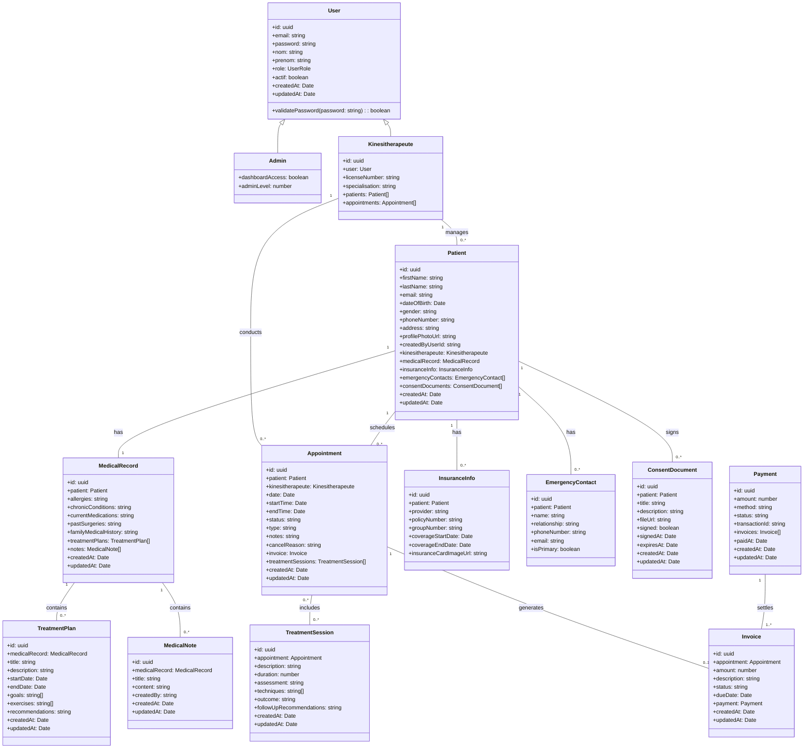

# Class Diagram

This document provides a UML class diagram representing the main entities in the KINE-SAAS system.

## Entity Relationships

## Entity Descriptions

### User
Base user entity with authentication information and common fields.

### Admin
Administrative users with system management privileges.

### Kinesitherapeute
Healthcare professionals providing kinesiotherapy services.

### Patient
Individuals receiving treatment from kinesitherapeutes.

### MedicalRecord
Patient medical history and information.

### EmergencyContact
Contact information for patient emergencies.

### InsuranceInfo
Patient insurance details.

### Appointment
Scheduled sessions between patients and kinesitherapeutes.

### TreatmentSession
Detailed records of treatment provided during appointments.

### TreatmentPlan
Structured plan for patient recovery.

### MedicalNote
Clinical notes about patient condition and progress.

### ConsentDocument
Patient-signed documents for legal consent.

### Invoice
Billing information for services provided.

### Payment
Financial transaction records.
