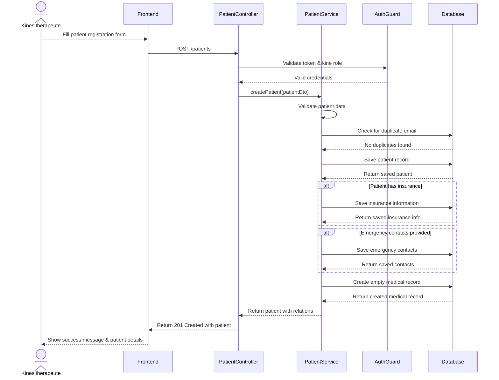
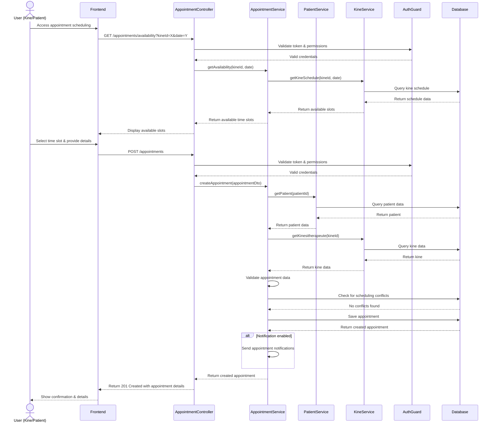

# Sequence Diagrams

This document contains sequence diagrams illustrating key processes in the KINE-SAAS system.

## Register Patient Sequence

This diagram shows the process of registering a new patient in the system.

## Schedule Consultation Sequence

This diagram illustrates the process of scheduling a consultation/appointment.

These diagrams represent the core workflow for the specified processes in the KINE-SAAS system. They show the interaction between users, the frontend, backend services, and the database.
