# Use Case Diagram

This diagram illustrates the main actors and use cases in the KINE-SAAS system.

## System Actors

1. **Admin** - System administrators who manage users and overall system
2. **Kinesitherapeute** - Healthcare professionals providing kinesiotherapy services
3. **Patient** - Individuals receiving treatment from kinesitherapeutes

## Use Cases Overview

```mermaid
flowchart TD
    subgraph Actors
        A[Admin]
        K[Kinesitherapeute]
        P[Patient]
    end

    subgraph UserManagement
        UM1[Manage Users]
        UM2[Register User]
        UM3[Manage Roles]
        UM4[Reset Password]
    end

    subgraph PatientManagement
        PM1[Register Patient]
        PM2[Update Patient Profile]
        PM3[Search Patients]
        PM4[View Patient History]
    end

    subgraph MedicalRecords
        MR1[Create Medical Record]
        MR2[Update Medical Record]
        MR3[View Medical Record]
        MR4[Add Medical Notes]
    end

    subgraph AppointmentManagement
        AM1[Schedule Appointment]
        AM2[Reschedule Appointment]
        AM3[Cancel Appointment]
        AM4[View Calendar]
    end

    subgraph DocumentManagement
        DM1[Upload Documents]
        DM2[Sign Documents]
        DM3[Share Documents]
        DM4[Download Documents]
    end

    subgraph Billing
        B1[Generate Invoice]
        B2[Process Payment]
        B3[View Payment History]
    end

    A --> UM1
    A --> UM2
    A --> UM3
    A --> UM4
    
    K --> PM1
    K --> PM2
    K --> PM3
    K --> PM4
    K --> MR1
    K --> MR2
    K --> MR3
    K --> MR4
    K --> AM1
    K --> AM2
    K --> AM3
    K --> AM4
    K --> DM1
    K --> DM3
    K --> DM4
    K --> B1
    K --> B3
    
    P --> PM2
    P --> MR3
    P --> AM1
    P --> AM2
    P --> AM3
    P --> AM4
    P --> DM2
    P --> DM4
    P --> B2
    P --> B3
```

## Use Cases Details

### User Management
- **Manage Users**: Create, update, deactivate user accounts
- **Register User**: Create new user accounts (admin, kinesitherapeute)
- **Manage Roles**: Assign or change user roles
- **Reset Password**: Reset user passwords

### Patient Management
- **Register Patient**: Create new patient records
- **Update Patient Profile**: Edit patient information
- **Search Patients**: Find patients using various criteria
- **View Patient History**: See patient's complete history

### Medical Records
- **Create Medical Record**: Create a new medical record for a patient
- **Update Medical Record**: Update existing medical information
- **View Medical Record**: Access patient's medical information
- **Add Medical Notes**: Add clinical notes to patient record

### Appointment Management
- **Schedule Appointment**: Create new appointments
- **Reschedule Appointment**: Change appointment date/time
- **Cancel Appointment**: Cancel scheduled appointments
- **View Calendar**: See daily/weekly/monthly schedules

### Document Management
- **Upload Documents**: Add medical documents to patient records
- **Sign Documents**: Digitally sign documents for consent
- **Share Documents**: Share documents between authorized parties
- **Download Documents**: Download patient documents

### Billing
- **Generate Invoice**: Create invoices for services
- **Process Payment**: Register patient payments
- **View Payment History**: See payment status and history
