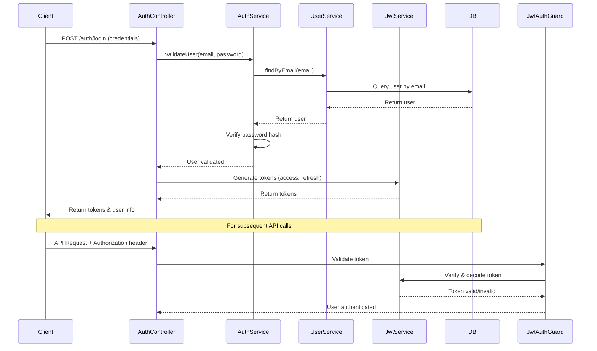

# Security & Authentication

This document outlines the security architecture and authentication system in the KINE-SAAS application.

## Authentication System

KINE-SAAS uses a JWT (JSON Web Token) based authentication system, providing stateless authentication for the API.

### Authentication Flow



### JWT Token Structure

- **Access Token**: Short-lived token (15-60 minutes) for API access
- **Refresh Token**: Long-lived token (7-30 days) for obtaining new access tokens

Token payload contains:
```json
{
  "sub": "user-uuid",
  "email": "user@example.com",
  "role": "KINESITHERAPEUTE",
  "iat": 1620000000,
  "exp": 1620003600
}
```

## Role-Based Authorization

KINE-SAAS implements role-based access control (RBAC) to manage permissions.

### User Roles

- **ADMIN**: Full system access
- **KINESITHERAPEUTE**: Access to manage patients and appointments
- **PATIENT**: Limited access to personal information and appointments

### Role Implementation

Roles are enforced using custom guards and decorators:

```typescript
// Role decorator
@SetMetadata('roles', roles)
export const Roles = (...roles: UserRole[]) => SetMetadata('roles', roles);

// Usage in controller
@Post()
@Roles(UserRole.ADMIN, UserRole.KINESITHERAPEUTE)
createPatient(@Body() createPatientDto: CreatePatientDto) {
  // Implementation
}
```

### RolesGuard

The `RolesGuard` checks if the user has the required role for a route:

```typescript
@Injectable()
export class RolesGuard implements CanActivate {
  constructor(private reflector: Reflector) {}

  canActivate(context: ExecutionContext): boolean {
    const requiredRoles = this.reflector.getAllAndOverride<UserRole[]>('roles', [
      context.getHandler(),
      context.getClass(),
    ]);
    
    if (!requiredRoles) {
      return true;
    }
    
    const { user } = context.switchToHttp().getRequest();
    return requiredRoles.includes(user.role);
  }
}
```

## Resource Ownership Protection

For certain operations, users should only access their own resources:

### OwnershipGuard

```typescript
@Injectable()
export class OwnershipGuard implements CanActivate {
  constructor(
    private reflector: Reflector,
    private userService: UserService,
  ) {}

  async canActivate(context: ExecutionContext): Promise<boolean> {
    const resourceType = this.reflector.get<string>('resourceType', context.getHandler());
    if (!resourceType) return true;

    const request = context.switchToHttp().getRequest();
    const user = request.user;
    const resourceId = request.params.id;
    
    // Admin bypass
    if (user.role === UserRole.ADMIN) {
      return true;
    }
    
    switch (resourceType) {
      case 'patient':
        return this.checkPatientOwnership(user, resourceId);
      case 'appointment':
        return this.checkAppointmentOwnership(user, resourceId);
      // Other resource types
    }
    
    return false;
  }

  private async checkPatientOwnership(user, patientId): Promise<boolean> {
    // Implementation to verify ownership
  }
}
```

## Password Security

Passwords are securely handled using:

- BCrypt hashing with appropriate salt rounds
- Password complexity requirements
- Rate limiting on authentication attempts

```typescript
// Password hashing implementation
async hashPassword(password: string): Promise<string> {
  const saltRounds = 10;
  return await bcrypt.hash(password, saltRounds);
}

// Password validation
async validatePassword(plainPassword: string, hashedPassword: string): Promise<boolean> {
  return await bcrypt.compare(plainPassword, hashedPassword);
}
```

## Request Validation

All incoming requests are validated using:

- DTOs with class-validator decorators
- Global validation pipe in NestJS
- Content type restrictions

```typescript
// Example DTO with validation
export class CreateUserDto {
  @IsEmail()
  email: string;
  
  @IsString()
  @MinLength(8)
  @Matches(/^(?=.*[a-z])(?=.*[A-Z])(?=.*\d)[a-zA-Z\d]{8,}$/, {
    message: 'Password must contain at least 8 characters, one uppercase letter, one lowercase letter, and one number',
  })
  password: string;
  
  @IsString()
  @IsNotEmpty()
  nom: string;
  
  @IsString()
  @IsNotEmpty()
  prenom: string;
}
```

## Security Headers

The application uses security headers to protect against common web vulnerabilities:

```typescript
// In main.ts
app.use(helmet()); // Adds security headers

// CORS configuration
app.enableCors({
  origin: process.env.ALLOWED_ORIGINS?.split(',') || '*',
  methods: 'GET,HEAD,PUT,PATCH,POST,DELETE',
  credentials: true,
});
```

## API Rate Limiting

To prevent abuse and DoS attacks, rate limiting is implemented:

```typescript
// In main.ts
app.use(
  rateLimit({
    windowMs: 15 * 60 * 1000, // 15 minutes
    max: 100, // Limit each IP to 100 requests per windowMs
  }),
);
```

## Data Protection

Sensitive data protection measures:

- Encryption of sensitive data in the database
- Data minimization in API responses
- Strict typing to prevent data leakage

## Security Best Practices

### Protecting Sensitive Endpoints

1. **Always use authorization guards**:
   ```typescript
   @UseGuards(JwtAuthGuard, RolesGuard)
   export class PatientController { ... }
   ```

2. **Validate request body, params, and query**:
   ```typescript
   @Post()
   create(
     @Body(ValidationPipe) createDto: CreateDto,
     @Query(ValidationPipe) query: QueryDto,
   ) { ... }
   ```

3. **Implement proper error handling**:
   ```typescript
   try {
     // Operation
   } catch (error) {
     // Don't expose internal errors to clients
     throw new HttpException('Operation failed', HttpStatus.INTERNAL_SERVER_ERROR);
   }
   ```

4. **Audit sensitive operations**:
   ```typescript
   @Post()
   async createUser(@Body() createUserDto: CreateUserDto, @Request() req) {
     const user = await this.userService.create(createUserDto);
     this.auditService.log({
       action: 'CREATE_USER',
       userId: req.user?.id,
       targetId: user.id,
       timestamp: new Date(),
     });
     return user;
   }
   ```

### Environment Variables

- Use `.env` files for local development only
- Use secure environment variable management in production
- Never commit sensitive values to version control

## Logging and Monitoring

Security events are logged for monitoring and auditing:

```typescript
// In the auth service
async login(user: any) {
  this.logger.log(`Login attempt for user: ${user.email}`);
  
  // Login implementation
  
  this.logger.log(`User ${user.email} logged in successfully`);
}
```

## Regular Security Updates

Maintain system security by:
- Keeping dependencies up-to-date
- Monitoring security bulletins for NestJS and related packages
- Regular security audits
